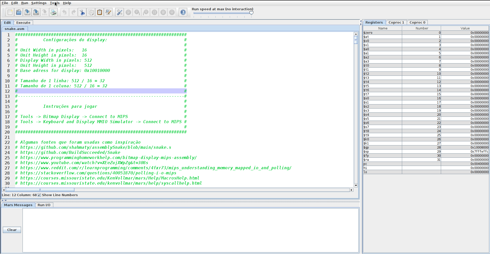
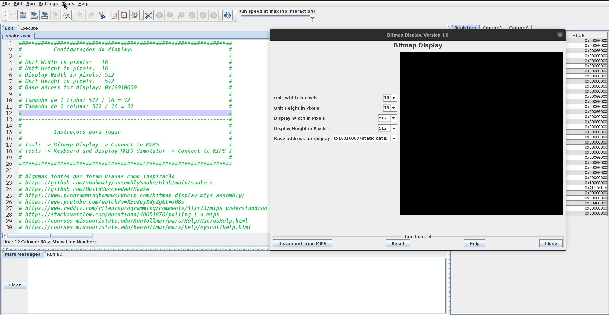
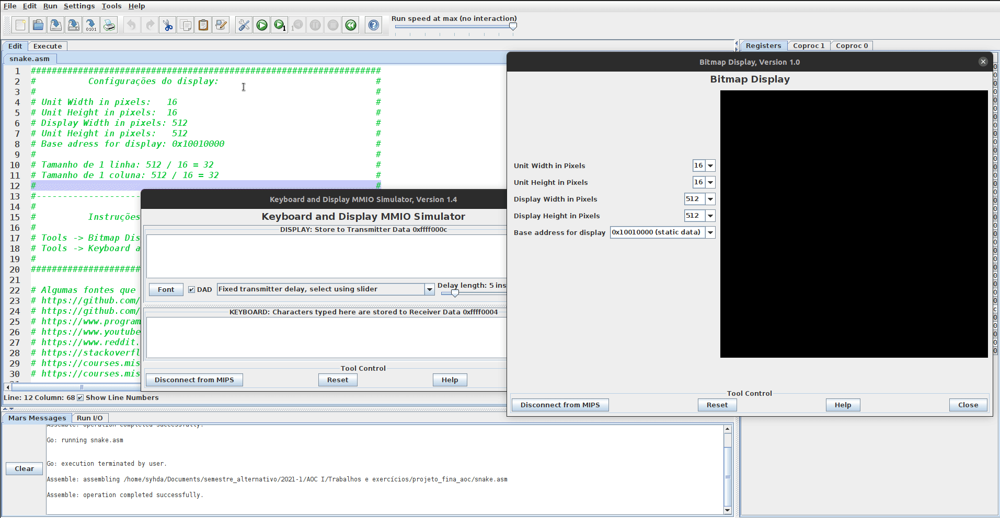

# SNAKE-MIPS
Snake para o MIPS feita em assembly.

# Instruções

### Configurações do Display
No menu `Tools`, selecionar `Bitmap Display`. Configurar e clicar em `Connect to MIPS`.

Unit Width in pixels: 16

Unit height in pixels: 16

Display width in pixels: 512

Display height in pixels: 512

Base address for display: 0x10010000 (static data)

### Configurações do Keyboard Simulator

No meu `Tools`, selecionar `Keyboard and Display MMIO Simulator`. Clicar em `Connect to MIPS`.

# Como jogar
As teclas `w`, `a`, `s` e `d` movimentam a snake. Qualquer outra tecla que for pressionada pausa o jogo.

Quando a snake encosta nas paredes ou nela mesma o jogo é resetado. O score final é printado no console do Mars.

